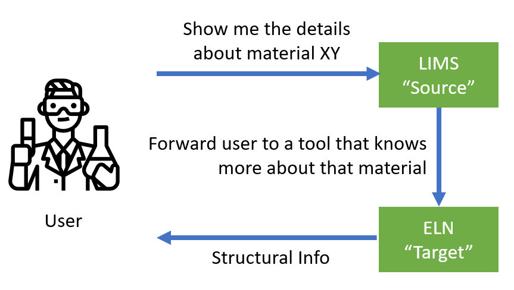
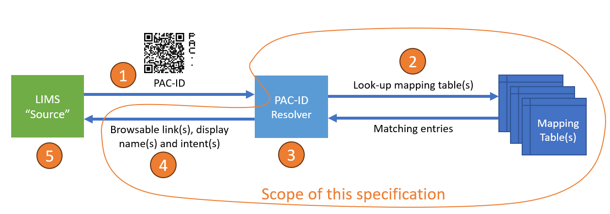

# PAC-ID Resolver

## What Is the `PAC-ID Resolver`?

## Introduction
In laboratory workflows, it is often necessary to utilize multiple software applications and devices. Dealing with chemicals, samples, and instruments requires a seamless exchange of contextual data between these applications and devices, significantly benefiting scientists and lab technicians.

The conventional approach involves interfacing applications and devices with each other. Unfortunately, due to the lack of standardized support, such interfaces usually require bespoke software development or customization projects, demanding substantial effort to create and maintain.

The PAC-ID resolver architecture introduced here offers an alternative and lightweight solution for implementing handover between applications and devices in a loosely coupled manner, providing an exceptional user experience.

By utilizing PAC-IDs to identify chemicals, samples, and instruments, the PAC-ID resolver architecture supports the efficient conversion from a PAC-ID into a browsable link that directs users to the application most relevant to the current workflow context.

*User Perspective: Example of resolving a PAC-ID of a  “material XY” within a LIMS system and forwarding the user to the corresponding structural info in the ELN*

The PAC-ID resolver architecture has been designed with the following design goals:
- **Decentralized operation**: The PAC-ID resolver architecture should be able to operate independently without relying on a central registry.
- **Local customization**: It should allow local overrides of PAC-ID to link conversion mechanisms, enabling customization for local context specific needs.
- **Flexibility and independence**: The PAC-ID resolver architecture should function without strict governance, providing flexibility and independence in its operation.
- **Isolated network compatibility**: It should be capable of operating effectively in isolated networks, even with limited or no connectivity to external resources.

## Specification
A PAC-ID resolver is a service or library used by a source application to resolve a PAC-ID into one or more browsable link(s). 

A PAC-ID resolver expects a PAC-ID as input. In order to resolve the PAC-ID, the PAC-ID resolver uses one or more mapping table(s). It selects all entries that match the current PAC-ID and substitutes information in these resolved entries. After completion, it returns a list of zero or more browsable links in conjunction with display names and intents to the source application.

## Architectural Overview and Scope
The process of resolving a PAC-ID into a browsable link follows these steps, as illustrated below:
1. The source application sends a PAC-ID to the PAC-ID resolver
2. The resolver looks up mapping tables
3. The resolver selects entries in the mapping tables that match the PAC-ID and substitutes existing placeholders (see below)
4. The resolver returns an ordered list, sorted by relevance of browsable links, display names and intents to the source application
5. The source application selects the most appropriate link based on the returned of browsable links, display names and intents, considering additional context-dependent or user-provided information

*Architectural overview of resolving a PAC-ID into a browsable link.*

## PAC-ID Resolver
The PAC-ID resolver performs the following steps:
1. Retrieve mapping table(s)
2. Match the PAC-ID to the entries in the mapping table(s) and select matching entries
3. Substitute the placeholders in the matching entries (see below)
4. Return an ordered list of browsable links, display names and intents, derived from all matching entries. The order SHALL correspond to the source of the matching entry (user, corporate or global mapping table, in this order of precedence)

### Retrieving Mapping Table(s)
The following methods SHALL be used to retrieve mapping table(s).

#### User Mapping Table
The user mapping table SHALL be retrieved by reading a file or via a HTTP GET request to an URL. The file or URL SHALL be configurable. It is RECOMMENDED as a best practice to use a local file called “`pac.mapping`", located in the user's home directory.

#### Corporate Mapping Table
The corporate mapping SHALL be retrieved by reading a file or via a HTTP GET request to an URL. The file or URL SHALL be configurable. It is RECOMMENDED as a best practice to use the URL “`pac.local/pac.mapping`".

#### Global Mapping Table
The global mapping table SHALL be retrieved via a HTTP GET request to the URL “`pac.{issuer}/pac.mapping`”. Where “`issuer`“ MUST be replaced by the appropriate value from the PAC-ID.

### Matching PAC-ID to Entries in the Mapping Table
To identify matching entries in a mapping table, compare the PAC-ID’s issuer and category against the **Issuer** and **Category** columns of the mapping table.

### Substituting Placeholders
Mapping table entries MAY contain placeholders in the **Link** column. Replace the placeholders with the corresponding values given by the PAC-ID by performing a text replacement.

### Mapping Table Format
The mapping table SHALL be a text string, containing zero or more mapping entries (rows), separated by “`newline`" and formatted with “`tab`" delimited columns as follows. When serializing into a file or into a binary stream or array, the contents SHALL be encoded using UTF-8 encoding. Lines starting with the “`#`" character SHALL be ignored and treated as comments until the next “`newline`". The first non-comment row MUST contain a header, composed of the column names from the table below, delimited by "`tab`" and ended by “`newline`":

| **Column #** | **Column Name** | **Comment** |
| :--- | :--- | :--- |
| 1 | **Issuer** | A PAC-ID “`issuer`“ or “`*`", which matches any issuer. |
| 2 | **Category** | A PAC-ID “`category`" or ”`*`", which matches any category. |
| 3 | **Intent** | The intent provides a hint / additional information related to the context in which the link should be used. The intent is comparable to a file type on a file system and may consist of a maximum of 64 characters. MUST match the regular expression ^[A-Za-z0-9-]{0,64}$. It can also be the empty string. Note: Intents ending with “`-public`" SHALL be reserved for future use. |
| 4 | **Link** | A URL that MAY contain one or more instances of each of the following text placeholders `{issuer}`, `{category}` or `{identifier}`. When replacing the placeholders with the appropriate values from a PAC-ID, the result MUST become a valid browsable link (i.e. HTTPS URL). Note: The `identifier` value of the PAC-ID MUST be URL encoded first before inserting into the placeholder. |
| 5 | **Display Name** | The display name is describing this entry in human readable, US-English language. Containing letters, numbers, spaces or hyphens (“-”) only and MUST NOT contain more than 255 characters. Can also be the empty string. |

#### Example Mapping Table
    # This is a comment
    Issuer -> Category -> Intent -> Link -> Display Name
    apinilabs.com -> myapp -> calibration -> https://app.apinilabs.com/{category}/{identifier} -> Calibration Log
    domain.com  -> inventory -> * -> https://domain.com/app/{category}?ident={identifier} -> Inventory System
    # ... more entries ...`
`->` denotes a tab character.

## Terminology Used
The key words "MUST", "MUST NOT", "REQUIRED", "SHALL", "SHALL NOT", "SHOULD", "SHOULD NOT", "RECOMMENDED", "MAY", and "OPTIONAL" in this document are to be interpreted as described in [RFC 2119](https://www.ietf.org/rfc/rfc2119.txt) "Key words for use in RFCs to Indicate Requirement Levels".

## FAQ
**Q: Where to find the URLs for the** Link **column?**

**A:** Copy the link from the address bar of your browser. Most of the time, such links are self-explaining. If in doubt, ask your vendor about so-called perma-links or a link scheme.

**Q: Is there something like authentication?**

**A:** If a link to your system requires authentication, normal authentication takes place always, independent of how you navigate to this link.

**Q: What if a mapping URL is changing?**

**A:** Update the mapping table. Use a local override, like a user or corporate mapping table if needed.

**Q: How to use only a part of the id or category in placeholders?**

**A:** This is currently not foreseen / possible.

## License
Shield: [![CC BY-SA 4.0][cc-by-sa-shield]][cc-by-sa]

This work is licensed under a
[Creative Commons Attribution-ShareAlike 4.0 International License][cc-by-sa].

[![CC BY-SA 4.0][cc-by-sa-image]][cc-by-sa]

[cc-by-sa]: http://creativecommons.org/licenses/by-sa/4.0/
[cc-by-sa-image]: https://licensebuttons.net/l/by-sa/4.0/88x31.png
[cc-by-sa-shield]: https://img.shields.io/badge/License-CC%20BY--SA%204.0-lightgrey.svg
